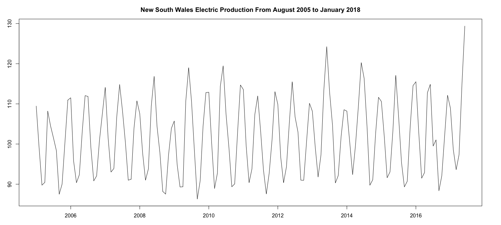
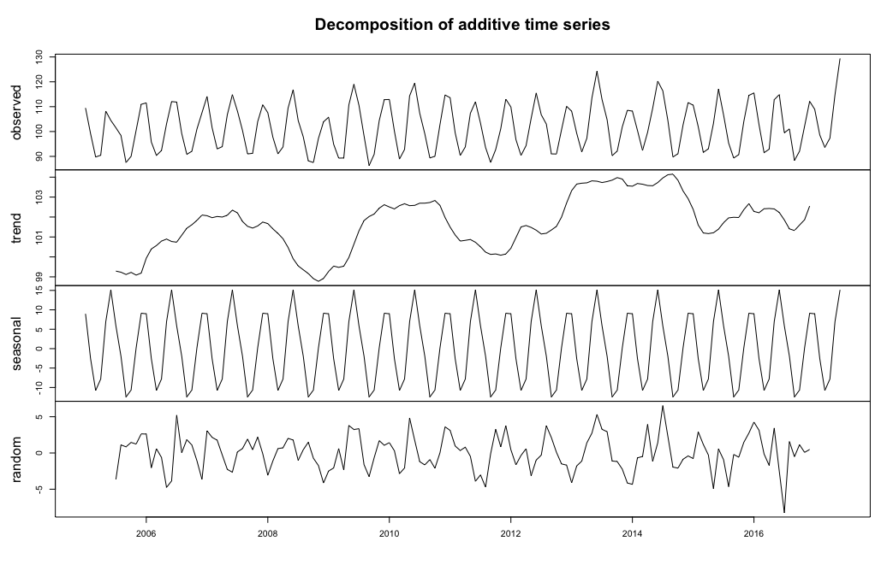
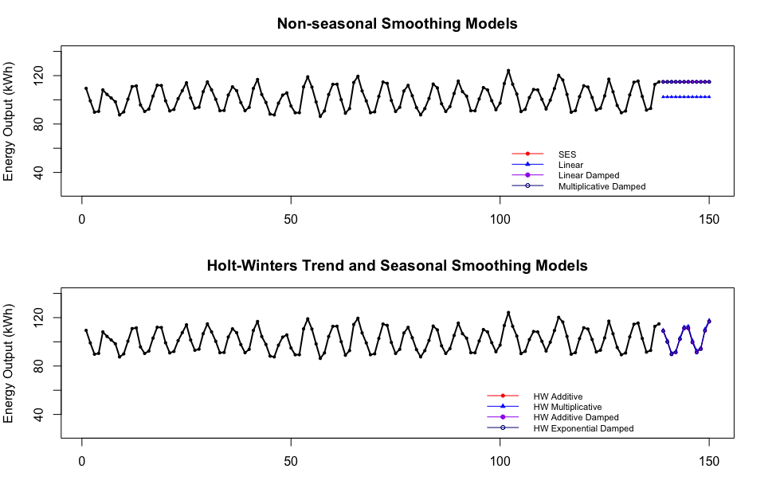

```{r setup, include=FALSE}
options(htmltools.dir.version = FALSE)
if (!require("knitr")) {
   install.packages("knitr")
   library(knitr)
}
if (!require("pander")) {
   install.packages("pander")
   library(pander)
}
if (!require("plotly")) {
   install.packages("plotly")
   library(plotly)
}
if (!require("ggplot2")) {
   install.packages("ggplot2")
   library(ggplot2)
}
if (!require("xaringanthemer")) {
   install.packages("xaringanthemer")
   library(xaringanthemer)
}
knitr::opts_chunk$set(
                  fig.width=3, 
                  fig.height=3, 
                  fig.retina=12,
                  out.width = "100%",
                  cache = FALSE,
                  echo = TRUE,
                  message = FALSE, 
                  warning = FALSE,
                  hiline = TRUE
                  )
```

name:toc
class:inverse1, top

<h1 align="center"> Table of Contents </h1>
<BR>
<table align="center", width = "50%">
<tr>
<td style="text-size:50px; line-height: 1.5; font-variant:small-caps">

<font size = 6><b> Research Question </b></font> <br>
  
<font size = 6><b> Background Information </b></font> <br>

<font size = 6><b> Exploratory Data Analysis </b></font> <br>
 
<font size = 6><b> Statistical Techniques </b></font> <br>

<font size = 6><b> Results </b></font> <br>

<font size = 6><b> Conclusions </b></font> <br>

<font size = 6><b> Challenges </b></font> <br>
</td>
</tr>
</table>

---
class:inverse middle center
name:researchquestion

<h1 align = "center">Research Question</h1>
<BR>

 If we decompose this time series data set, are there any distinct trends or seasonality apparent in the data?

 What is the ideal sample size for the training data set that we want to create from the original data set?

 What forecasting method best minimizes predictive error for this data? 

<div style="text-align: middle;">
  
</div>

---

class:inverse middle center
name:background

<h1 align = "center">Background Information</h1>
<BR>

 This data set was retrieved from kaggle

 The data set tracks the monthly electric production in kilowatt-hours (kWh) from January 1973 to December 2010 for the state of New South Wales, Australia

 The data set contains 456 total observations
 
 Observations were recorded on a monthly basis for this data set

<div style="text-align: middle;">
  
</div>

---

class:inverse middle center
name:EDA

<h1 align = "center">Exploratory Data Analysis</h1>
<BR>
 To begin the exploratory data analysis, we created a subset of 150 observations from the original data set

 Date variable was removed 

 New subset was plotted to assess for trends and seasonality

<div style="text-align: middle;">
  
</div>

---

class:inverse center
name:techniques

<h1 align = "center">Analysis of Trends and Seasonality</h1>
<BR>

 First we used a STL (Seasonal and Trend decomposition using Loess) and additive decomposition to further analyze the trend and seasonality of the data

<div style="text-align: center;">
  
</div>


---

class:inverse center
name:techniques

<h1 align = "center">Training Data</h1>
<BR>

 Next we tested different sample sizes of our training data in order to minmize model error
 
 These tests were based on the total error from models being created using the ts, stl, and forecast functions in R

<table border = "2" bordercolor="black"  bgcolor="white"  width="90%">
  <tr bordercolor="red">
    <th>Sample Size</th>
    <th>MSE</th>
    <th>MAPE</th>
  </tr>
  <tr>
    <td>144</td>
    <td>26.92753</td>
    <td>0.0346743</td>
  </tr>
  <tr>
    <td>109</td>
    <td>26.83099</td>
    <td>0.0345234</td>
  </tr>
  <tr>
    <td>73</td>
    <td>27.71894</td>
    <td>0.0347812</td>
  </tr>
  <tr>
    <td>48</td>
    <td>26.42848</td>
    <td>0.0355194</td>
  </tr>
</table>

 From this table, we can observe that the sample size of 109 for our training data set minmizes the MSE and MAPE

---

class:inverse center
name:techniques

<h1 align = "center">Model Building</h1>
<BR>

We will test a Holt-Winters model, a Simple Exponential Smoothing Model, a Additive model, and a Multiplicative model

Each model will be used to forecast future time series values outside of the original data set

We will choose a model that is best for this forecasting based on which model best minimizes error terms such as ME and MAPE

<div style="text-align: middle;">
  
</div>

---

class:inverse center
name:techniques

<h1 align = "center">Model Selection</h1>
<BR>

 Now that we have a training data set with sample size of 109, we can use that data set for forecasting
 
 Eight total models were created, but the table features the three with the lowest MAPE and ME

 First, we must choose a model with minimal error

<table border = "2" bordercolor="black"  bgcolor="white"  width="90%">
  <tr bordercolor="red">
    <th>Model Type</th>
    <th>ME</th>
    <th>MAPE</th>
  </tr>
  <tr>
    <td>HW Additive</td>
    <td>-0.0832</td>
    <td>2.1235</td>
  </tr>
  <tr>
    <td>HW Exponential Damped</td>
    <td>-0.0235</td>
    <td>2.0850</td>
  </tr>
  <tr>
    <td>Simple Exp Smoothing</td>
    <td>0.0388</td>
    <td>7.8211</td>
  </tr>
</table>

 Based upon the accuracy metrics for the models we have created, the Holt-Winters Exponential Damped model is the most accurate for forecasting the time series values of this data. We chose this model because it has the smallest MAPE.

---

class:inverse center
name:results

<h1 align = "center">Results</h1>
<BR>

<div style="text-align: center;">
  
</div>

---

class:inverse center
name:conclusion

<h1 align = "center">Conclusions</h1>
<BR>

Overall, in this analysis we discovered that there is a strong seasonality to the electric production in NSW Australia

There is also a trend of an overall increase in electric use over the progression of time

We also determined the optimal size of our training data set to be 109

We also concluded that the Holt-Winters Exponential Damped model is our model of choise for forecasting future values of this data 

<div style="text-align: middle;">
  
</div>

---
class: center, middle

# Thanks!

#Questions?

Slides created via the R packages:

[**xaringan**](https://github.com/yihui/xaringan)<br>
[gadenbuie/xaringanthemer](https://github.com/gadenbuie/xaringanthemer)


